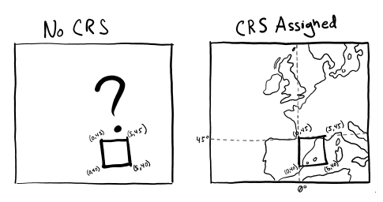

# Setting Up Your Computer

R packages are extensions to the R statistical programming language. R packages contain code, data, and documentation in a standardised collection format that can be installed by users of R. Each package (or library) adds additional functionality to the base functionality of R.  For instance `sf` allows us to read and write shapefiles, and do lots of core GIS operations, and `mapview` allows us to create interative maps.  The large number of packages available for R, and the ease of installing and using them, has been cited as a major factor driving the widespread adoption of the language in geography.

Before we begin our exercise, we need to install all the needed packages - we only need to use `install.packages()` once the first time you use a new package.  

```{r setup, include=FALSE}
knitr::opts_chunk$set(echo = TRUE)
knitr::opts_chunk$set(warning=FALSE)
```

In this case I have already installed all the needed packages, so we don't need to run the next block of code. 

```{r}

# DO NOT RUN INSTALL PACKAGES THIS HAS BEEN RUN FOR YOU ALREADY
# install required packages
#install.packages("tidyverse")
#install.packages("sf")
#install.packages("mapview")
#install.packages("dplyr")
```

*EVERY* time you start using R you will need to run `library()` to load the required packages that have already been installed. 

```{r}
#load packages
library(tidyverse)
library(sf)
library(mapview)
library(dplyr)

```


# Basic Data Structions

The most straight forward way to store a list of numbers is through an assignment using the `c()` command (c stands for "combine"). The idea is that a list of numbers is stored under a given name, and the name is used to refer to the data. A list is specified with the `c()` command, and assignment is specified with the "\<-" or "=" symbols. Another term used to describe the list of numbers is to call it a "vector".

The each element within the `c()` command is separated by commas.

As an example, we can create a new variable, called `bubba` which will contain the numbers 3, 5, 7, and 9:

```{r}
bubba = c(3,5,7,9)
```

When you enter this command you should not see any output except a new command line. The command creates a list of numbers called `bubba`. To see what numbers is included in bubba type `bubba` and press the `shift+control+enter` key:

```{r}
bubba
```

If you wish to work with one of the numbers you can get access to it using the variable and then square brackets indicating which number. Try the example below:

```{r}
bubba[2]
bubba[1]
```

Notice that the first entry is referred to as the number 1 entry.

You can store strings using both single and double quotes, and you can store real numbers.

```{r}
bubba = c('HI','1','some text')
bubba
```

Notice that we reassigned our original numeric vector as a character vector.

Try replacing a single element

```{r}
bubba[3] = 'more meaningful text'
bubba
```

Notice that you can't mix data types in a single vector

```{r}
bubba_test = c(1, 'hi','2')
bubba_test    # it simply converts 1 to '1' stored as a character
```

---------------------------------------------------

# Reading in a CSV file 

Unfortunately, it is rare to have just a few data points that you do not mind typing in at the prompt. It is much more common to have a lot of data points with complicated relationships. Here we will examine how to read a data set from a file using the read.csv function but first discuss the format of a data file.

We assume that the data file is in the format called "comma separated values" (csv). That is, each line contains a row of values which can be numbers or letters, and each value is separated by a comma. We also assume that the very first row contains a list of labels. The idea is that the labels in the top row are used to refer to the different columns of values.

First we read a very short data file. The data file is called `cities.csv` and has six columns of data and six rows. Each row is a city in the United States. 

cities.csv

| City         | State         | Population | Area  | Lat   | Lon   |
|--------------|---------------|------------|-------|-------|-------|
| New York     | New York      | 8467513    | 300.5 | 40.66 | 73.93 |
| Los Angeles  | California    | 3849297    | 469.5 | 34.01 | 18.41 |
| Chicago      | Illinois      | 2696555    | 227.7 | 41.83 | 87.68 |
| Houston      | Texas         | 2288250    | 640.4 | 29.78 | 95.39 |
| Phoenix      | Arizona       | 1624569    | 518   | 33.57 | 12.09 |
| Philadelphia | Pennsylvania  | 1576251    | 134.4 | 40    | 75.13 |


The command to read the data file is `read.csv()`. We have to give the command at least one arguments, but we will give three different arguments to indicate how the command can be used in different situations. 
 
When we read in our files we are going to use "relative paths" meaning we start in the folder/directory that this `.rmd` file is stored using `"./"` which is like saying "here", then we are going into the `data` folder from there, and then refer to the `simple.csv` file stored there.

The following command will read in the data and assign it to a variable called `US`. We set `head=TRUE` make sure we keep the first row holding the column names, and `sep=","` to indicate that this is a comma delimted text file.  

```{r}
US = read.csv(file="./data/cities.csv",head=TRUE,sep=",")
```
We can now see what's inside our new `US` object:

```{r}
US
```

You can also use head and tail to look at the top and bottom of your file:

```{r}
head(US, n=2)
```

```{r}
tail(US,n=3)
```

To get more information on the different options available you can use the help '?' command:

```{r}
?read.csv
```

The object `US` contains the three columns of data. Each column is assigned a name based on the header (the first line in the file). You can now access each individual column using a `$` to separate the two names:

```{r}
US$City
```

```{r}
US$Population
```


# Manipulating Data 

## Adding new columns

R can quickly and easily generate new columns, select values, etc. This will help you edit attribute tables quickly on the fly. For instance if we want to create a new column based on another column values we simply use `$` to create a new column name and `$` to access an existing column in our `data.frame` called `US`.

In this case we are going to create a new column called `pop_den` in the `US` dataset using `US$pop_den =`. We are going to assign it the values of the `Population` column divided by `Area`. 

Note: `*` is used for multiplication and `\` is used for division.

```{r}
US$pop_den = US$Population / US$Area  
US
```

## Subsetting attributes

One we often want to remove unwanted columns from our data. Let's say we wanted to keep only a few of our columns. To do this we can use the `subset()` function. Here we are creating a vector of variable names we want to select using `c()`.

```{r}
US_subset = subset(US, select = c(City,State,pop_den, Lat,Lon ))
```
 

## Spatial Features 

In this section we will be introducing the use of spatial data types. Spatial vector data (points, lines, polygons) is a simple extension of non-spatial 'dataframes' we were using above. Essentially we keep the data in the same order, but we add a few things including, most importantly, a column called `geometry` which in this case will hold the `Lat` `Lon` pairs for each US city in our dataset. 

We can assign a new `geometry` to our data by converting our dataframe into a `sf` (simple feature) datatype with the function `st_as_sf()`, which needs our original data `US` and the name of columns holding the `coords` (coordinates) for our points. 


```{r}
US_sp = st_as_sf(US, coords = c("Lon","Lat") )
US_sp
```

We can see that the geometry column has changed. 

```{r}
US_sp$geometry
```

Let's take a look at our city points on a map to see if it worked. 

```{r}
mapview(US_sp)
```

Hmmm... something is clearly wrong. I think we are in the ocean here.  

We told `US_sp` what the lat and lon of the points were. 

So what is wrong?

The issue here is that we haven't told `US_sp` what coordinate reference system (CRS) we are using. Is this a spherical projection using lat lon? Or is it a projected coordinate system measured in meters?  What is the prime meridian? Where is the origin (0,0)? 




Here's an example of two very different CRS definitions.  At the moment we haven't told it which one to use... 


Ok let's try again, from scratch. This time we will assign the `coords` as well as the coordinate reference system `crs`.  When programming we typically use something called EPSG codes to define a crs. Each projection or geographic crs is assigned a unique code - a EPSG code. 


```{r}
US_sp = st_as_sf(US, 
                coords = c("Lon","Lat"),
                crs=4326)
US_sp
```

To learn more about EPSG codes and crs more generally refer [here](https://pygis.io/docs/d_understand_crs_codes.html).


Ok let's see if that fixed things. 

```{r}
mapview(US_sp)
```

Perfect!  Ok actually its just ok. Let's see if we can make it more interesting.  Let's use `zcol` to tell `mapview` which column it should plot data from:

```{r}
mapview(US_sp, zcol='Population')
```
That's pretty good. But colors aren't a great way to communicate the size of a city. Instead let's change the size of the points based on their population using `cex` instead

```{r}
mapview(US_sp, cex='Population')
```

Huh.. Cool. Maybe we can improve things still. Let's assign size and color based on Population and add "moust-over" labels based on the city name.  

```{r}
mapview(US_sp, cex='Population', zcol='Population', label='City')
```


# Reading/Writing Shapefiles 

The `sf` library can also handle shapefiles (and a number of other formats). To do this, we need to use the `read_sf` function and point it to the shapefile we are interested in, in this case one of US population. 

Let's read it in and take a look:

```{r}
us_pop = read_sf('./data/polygon/US_pop.shp')
us_pop 
```

Note again the existence of the `geometry` column, this time holding polygons. Also note is has been assigned a `crs` of `NAD83`. 
Let's see what it looks like:

```{r}
mapview(us_pop,
        zcol="population")
```

We can use these polygon features to calculate spatial properties like area. Here we are creating a new column called `area` and assigning it the area of each polygon as calculated by `st_area`. As before we will be using `$` to create a new column to store the area of each polygon. 

```{r}
us_pop$area = st_area(us_pop)  
head(us_pop$area)
```

In turn we can use this to calculate population density and assign it to a new column `pop_den`. 

```{r}
us_pop$pop_den = us_pop$population / us_pop$area
mapview(us_pop,zcol="pop_den")
```

Weird! I don't see anything. There are two reasons for this. First, we calculated population density as  (population / meter$^2$), which creates very very small numbers (and probably some rounding errors), and second, we have an outlier - Zoom into Washington DC (the best city in America).  Washington is different because it is both a 'state' and a city - so its population density is an outlier - and is messing up the color scheme. Everything else is so much lower, they are all getting assigned the color purple. 

Let's try to fix this. First we will recalculate `area` but in population / km$^2$, and let's plot it again. 

```{r}
us_pop$area = as.numeric(st_area(us_pop) / (1000*1000) )
us_pop$pop_den =  us_pop$population / us_pop$area
mapview(us_pop,zcol="pop_den")
```

The number range on the legend looks better, but the color scheme isn't working yet. Let's look at the number range of `pop_den`. To get a sense of where the number are.

```{r}
range(us_pop$pop_den)
```

Maybe it will be more helpful to look at the histogram. We will use the `hist` function to create a histogram and `breaks` is assigned to 30 to create lots of bins (allows us to see more detail in the distribution).

```{r}
hist(us_pop$pop_den, breaks = 30)
```
Ok it looks like we have to assign a color scheme that ranges from 0 to somewhere around 500.  In this case we are going to use the `at` parameter to set the location of color breaks. To do this we are going to create a sequence of numbers (using `seq`) that starts at 0 and ends at 500, and counts by 50.  

```{r}
seq(from = 0, to= 500, by=50)
```

```{r}
mapview(us_pop, 
        zcol="pop_den",
        at = seq(from = 0, to= 500, by=50),
        label="NAME")
```

Amazing! Looks pretty good. Now let's assume we want to subset a few columns of interest and write out a new shapefile. We can do this, as before using `subset` to select the columns of interest, and `st_write` to write the `US_subset` back out as a shapefile.  Note I am using `delete_dsn` which allows you to overwrite any existing data with the same name. 

```{r}
US_subset = subset(US, select = c(City,State,pop_den, Lat,Lon ))
st_write(US_subset, "./data/polygon/US_pop_update.shp",delete_dsn=T)
```

Let's do one last thing. We often want to subset individual rows from a large dataset based on some condition. The package `dplyr` has lots of great tools for data maninpulation like this. In this case we will use the `filter()` function. For instance in this case we will subset rows where the `Lat` column is holding a value greater than 40. 


```{r}
northern = US_subset %>% filter(Lat > 40)
northern
```
 Or we can select a row based on a name, for checking for equality notice the use of `==` instead of `=`:
 
```{r}
Chicago =  US_subset %>% filter(City == 'Chicago')
Chicago
```


-----------------------------------------------


# Want to learn more about R basics?  
Swirl has a variety of lessons on methods in R.  These are interactive lessons and cover everything from basic data structures, to data visualization. 

```{r eval=FALSE, include=TRUE}
if(!require("swirl")) install.packages("swirl")
library(swirl)
install_course("R Programming")
swirl()
```

Additional titles are available [https://swirlstats.com/scn/title.html](https://swirlstats.com/scn/title.html) here. 


