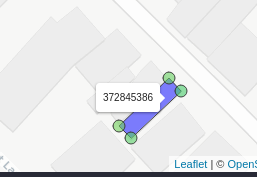

```{r default, include=FALSE}
knitr::opts_chunk$set(warning=FALSE)
```
 
# Setup

Before we begin our exercise, we need to install all the needed packages - we only need to use `install.packages()` once for each. However EVERY time you start using R you will need to run `library()` to load the installed package.

```{r setup, include=FALSE}
knitr::opts_chunk$set(echo = TRUE)

#install the osmdata, sf, tidyverse and ggmap package
if(!require("osmdata")) install.packages("osmdata")
if(!require("tidyverse")) install.packages("tidyverse")
if(!require("sf")) install.packages("sf")
if(!require("ggmap")) install.packages("ggmap")
if(!require("mapview")) install.packages("mapview")
if(!require("DiagrammeR")) install.packages("DiagrammeR")

#load packages
library(tidyverse)
library(osmdata)
library(sf)
library(ggmap)
library(mapview)
library(DiagrammeR)

```

In this exercise we are going to leverage the package `osmdata` to directly query and download features from OSM. This package will directly access the [Overpass Turbo API](https://wiki.openstreetmap.org/wiki/Overpass_turbo) to create and make queries directly from the R environment. Nevertheless, the use of the overpass-turbo.eu can be useful when we are not sure what we are looking for or when we have some difficulty in building the query.

See here for some basics on [OverpassTurbo](https://nixintel.info/osint-tools/getting-started-with-overpass-turbo-part-1/) and a formal guide on [queries](https://wiki.openstreetmap.org/wiki/Overpass_API/Language_Guide).

# Building a OSM query

In order to structure all the data in the world, OSM created a hierarchical data structure. In this case we can think of the world being broken down into spatial features (e.g. points, lines, polygons) each with a tag made up of a `Key` (e.g. amenity, building, highway etc) and `Value` (e.g. coffee shop, primary road).

We can look the tagging convension on [OSM's map features directory](https://wiki.openstreetmap.org/wiki/Map_features).


```{r echo=FALSE, fig.height=2, fig.width=2}

grViz(diagram = "digraph flowchart {
  node [fontname = arial, shape = rectangle]
  
  'Spatial Feature\n(e.g. polygon)' -> 'Feature Tags' ;
  'Feature Tags' -> 'Key\n(e.g. building)' ;
  'Key\n(e.g. building)' -> 'Value\n(e.g. supermarket)' ;
}
  ")
```

We can list all the the available OSM features using `available_features()` to list the available feature *keys*. In this case - to limit the length of the output we will use `head()` so we only view the first 5 features listed.

```{r}
# list top five
head(available_features())

# list all
# available_features()
```

Now we can see what the different types of buildings are based on their `tag value`. Here again we are using `head()` so that we only see the first five results.

```{r}
# list first 5 building types
head(available_tags("building"))

# list all building types
# available_tags("building")
```

# -------------------------------------------------------------- 

## Challenge


Use the `available_features()` and `available_tags("a_feature_name")` to find the feature and tag name for **stores** that sell **alcohol**.

```{r eval=FALSE, include=FALSE}
# feature: shop
# tag: alcohol
```

```{r}
# enter your answer here
```

# --------------------------------------------------------------

## Your First Query - Exploring Jamaica

In this example we will be exploring the area around you in Jamaica. First it helps to go to [OSM](https://www.openstreetmap.org/) and figure how features and tags can be found.

To find feature tag pairs zoom to a business of interest, right-click \> Show Address \> click on link to results \> top row is [feature, tag] in this case [amenity, bank].

{width="300"}

Ok let's start by trying to find and download data on restaurants in Montego Bay. To do this we need to create a bounding box using `getbb()`. Here make sure to be explicit, let's search for `"Montego Bay, Jamaica"` to avoid other locations called Montego Bay. This then gets passed to the `opq()` function to convert that into an overpass query based on location, then we pass an additional argument to the query using `add_osm_feature()`, in particular we are going to look for, in this case a feature key `"amenity"` and a tag value `"restaurant"`.

```{r}
query = getbb(place_name="Montego Bay, Jamaica") %>%
      opq() %>%
       add_osm_feature(key="amenity", value="restaurant")
```

We can then look at how the query is structured before it is passed to overpass turbo.

```{r}
query
```

Although it looks complex, we can see it has a few important components, one called `bbox` which is the bounding box (extent of) for Montego Bay, it as features with key `"amenity"` and tag value `"restaurant"`.

We can then send our query and retrieve the objects as "simple feature" `sf` objects in R. You can think of `sf` as being a component of R developed to handle spatial vector features (points, lines, polygons) and their attribute tables. For more on `sf` see [here](<https://r-spatial.github.io/sf/>).

Run the query, depending on the size of the query and your internet speeds this might take a bit of time.

```{r}
restaurant = osmdata_sf(q=query)
restaurant
```

`restaurant` is now an object with a few different components `restaurant$bbox` will give us back the bounding box, `restaurant$osm_points` contains 66 point features (i.e. the restaurants) and `restaurant$osm_polygons` has 15 polygons (?the restraurants in polygon?).

To help us understand what we got back from overpass turbo, let's put them on a map. To do this we will use the `mapview` function from the excellent `mapview` package. `mapview` will automatically generate an interactive webmap based on `leaflet`.

## Plotting on a Map

Let's create an interactive map by passing the `restaurant$osm_points` to `mapview`. Note we are turning off the legend by setting it to `F`, if you want it on, set `legend=T`.

```{r}
mapview(restaurant$osm_points, legend=F)
```

`mapview` makes it extremely easy to combine multiple sets of data to a map. In this case we will just `+` two `mapview` objects of interests.

In this case let's see what the difference between the `restaurant$osm_polygons` and `restaurant$osm_points` are. Zoom in an see if they are different.

```{r}
mapview(restaurant$osm_polygons, legend=F) + 
  mapview(restaurant$osm_points, legend=F)

```

Looks like the points are just the exterior of our polygons. Maybe we just plot the polygons instead of the points.

Before we go on, try hovering over one of the points or polygons. Note that there is a popup window, with info that isn't very informative



Let's clean this up. To do this we need to track down the restaurant names somewhere in our data. Let's see what other data is in the `restaurant$osm_polygons` data frame.

```{r}
head(restaurant$osm_polygons)
```

Looks like there is a column called `name` which holds the name of each restaurant polygon. Let's see if we can figure out how to access it. In R `$` is often used to access data by column name. Let's try `restaurant$osm_polygons$name` .

```{r}
restaurant$osm_polygons$name
```

Perfect. Got it.

Ok now let's pass a few more arguments to the `mapview` function to pretty things up. We can set the on-click data with `label` the color of the polygon outline with `color` and the polygon fill color with `col.regions`.

```{r}
mapview(restaurant$osm_polygons, 
        legend=F, 
        label = restaurant$osm_polygons$name, 
        color = 'red', 
        col.regions='red')  
```

# --------------------------------------------------------------

## Challenge

Create a map containing the polygons for both restaurants and pharmacies in Kingston.

Remember in coding, its always recommend to copy and paste a working example.

```{r eval=FALSE, include=FALSE}
# answer
query = getbb(place_name="Kingston, Jamaica") %>%
      opq() %>%
       add_osm_feature(key="amenity", value="restaurant")
restaurant = osmdata_sf(q=query)


query = getbb(place_name="Kingston, Jamaica") %>%
      opq() %>%
       add_osm_feature(key="amenity", value="pharmacy")
pharmacy = osmdata_sf(q=query)

```

```{r eval=FALSE, include=FALSE}
#answer
mapview(restaurant$osm_polygons, legend=F, label = restaurant$osm_polygons$name ) + mapview(pharmacy$osm_polygons, legend=F, label = restaurant$osm_polygons$name )
```

```{r}
# insert your code here
```

# --------------------------------------------------------------

## Additional Tricks

We can also use `grep` to search the available features. In this case I will find any features that contain the word `'building`'.

```{r}
# search for the following pattern
search_string = 'building'

# search function (don't edit)
available_features()[grep(search_string, available_features(),ignore.case=T)]
```

# --------------------------------------------------------------

## Other resources

\#<https://dominicroye.github.io/en/2018/accessing-openstreetmap-data-with-r/>

\# <https://towardsdatascience.com/calculating-building-density-in-r-with-osm-data-e9d85c701e19>

\#<https://dominicroye.github.io/en/2018/accessing-openstreetmap-data-with-r/>

\#<https://docs.ropensci.org/osmdata/>
