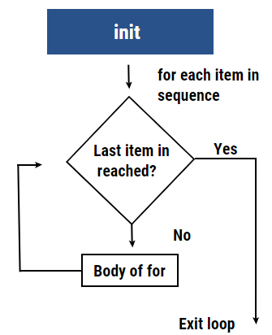

```{r setup, include=FALSE}
knitr::opts_chunk$set(warning=FALSE)
```
# Packages  

We are going to extend the capabilities of R by installing and importing packages written by folks like you. For a list of packages relevant to spatial data go to  [http://cran.r-project.org/web/views/Spatial.html](http://cran.r-project.org/web/views/Spatial.html)

The first time you use a new version of R you will have to install all your packages. Try installing the raster package:

I have already done this for you so please don't run this:

```{r eval=FALSE, include=TRUE}
# already installed
#install.packages('raster')
```

Now it is installed in your computer but isn't loaded. You will have to 'import' the libraries (packages) you want to use every time you start up R. 

```{r}
library(raster)
```

Another syntax that is often useful is the following `if(!require("swirl")) install.packages("swirl")`. This forces R to check if the library is available, and if it is not, it will install it for you. 

You can always look up what functions are available in a given package by looking at the help (run the following, scroll to bottom and click on `[Package raster version 3.6-11 Index]`):

```{r}
?raster
```


# A for loop  

One of the most powerful functions in programming is the ability to do loops or iteration. For loops simple loop through a series of numbers or alternatively elements in a vector. The for loop syntax in R is similar to that of python or any other language.

For example, below is the syntax of for loop in R.

```
for (val in sequence) {
Statement
}
```

In the above syntax, the vector is represented by sequence, and val is the value of the vector during the For Loop.

Now let’s see the process undertaken by for loop condition with the help of a flow chart. First, the loop repeats itself for every item in the sequence until the required condition is reached. Then, the condition is checked, and when the last item is reached compiler exists the loop.



The structure consists of initialization shown as “init,” the rhombus, a decision box, and a rectangular box that is the body of the for a loop. While executing a set of commands under for loop condition, the compiler doesn’t start the loop until the condition is specified. If there is no condition available, the next instruction after the loop will be executed. For each item in the sequence, the condition is matched. Until the condition isn’t matched, the loop goes over and over again. Once the last item or the condition is satisfied, the compiler exists in the loop.

The basic for loop iterating through a numeric sequence:

```{r}
for(i in c(1:10)){
    print(i)
}
```

Loop through a list of names:

```{r}
names= c('sally','jim','george')
for(name in names){
    print(name)  # notice we use 'name' here not 'names'
}
```

Note that the 'iterator' variable `i` and `name` in the examples above are updated each step of the loop. In the first iteration above, `name='sally'`, the second `name='jim'` and the final step `name='george'`.  These names are arbitrary, but I often like to use singular and plural for these for instance `for(name in names)` or `for(file in files)`. 

The 'scope' of the loop, or the extent of what code is looped though is defined with curly brackets `{}` in R. Only the the code inside these brackets will be looped. Once the loop is complete it will execute the rest of the code below the curly brackets. 

For instance, look at the 'scope' of the loop in the following example. The final line is only executed after the loop completes. 

```{r}
states = c('Oregon', 'Florida', 'Texas', 'Lowa', 'Nebraska', 'utah')
for (str in states) {
   print(paste("States in USA: ",str))
}
print('but I live in Washington DC')
```

## Nested for loops

We can also create nested loops that iterate through two sets of data:

```{r}
numbers = c(1,2,3)
names = c('sally','jim','george')

for(number in numbers){
    for(name in names){
        print(number)
        print(name)
    }
}
```

# CHALLENGE 1 
Create a for loop that prints the names of your three nearest neighbors.

```{r}
### ### ### ### ### 
# YOUR CODE HERE
### ### ### ### ### 
```

```{r eval=FALSE, include=FALSE}
# answer
names = c('mike','jim','sally')

for(name in names){
   print(name)
}

```

# CHALLENGE 2 
Use a nested loop that prints your, and 2 of your team member's names and ages.

```{r}
### ### ### ### ### 
# YOUR CODE HERE
### ### ### ### ### 
```

```{r eval=FALSE, include=FALSE}
# answer
names = c('mike','jim','sally')
ages = c(42,25,35)

for(name in names){
    for(age in ages){
        print(name)
        print(age)
    }
}

```

# EXTRA CHALLENGE 3  
Create a nested loop that prints each element of a matrix. Start with the first row, first column then move to the second column and continue until you have printed back all the elements. 

Important: to access rows and columns of `printme` use the notation `printme[row,column]`, so `printme[1,3]` would be the 1st row, 3rd column. Also remember to use the `print()` function to print out the response, e.g. `print(printme[1,3])`.

```{r}
printme = matrix(c(1,2,3,4,5,6,7,8,9), nrow=3, ncol=3)
printme
```

```{r}
### ### ### ### ### 
# YOUR CODE HERE
### ### ### ### ### 
```

```{r eval=FALSE, include=FALSE}
for(row in c(1,2,3)){
    for(col in c(1,2,3)){
         print(printme[row,col])
    }
}

```


# Want to learn more about R basics?  
Swirl has a variety of lessons on methods in R.  These are interactive lessons and cover everything from basic data structures, to data visualization. 

```{r eval=FALSE, include=TRUE}
if(!require("swirl")) install.packages("swirl")
library(swirl)
install_course("R Programming")
swirl()
```

Additional titles are available [https://swirlstats.com/scn/title.html](https://swirlstats.com/scn/title.html) here. 

