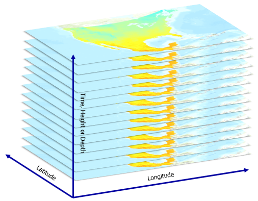

```{r setup, include=FALSE}
knitr::opts_chunk$set(warning=FALSE)
```

The first time you use a new version of R you will have to install all your packages. Try installing the raster and rgdal packages if you don't have them already:

```{r warning=FALSE, echo=FALSE}
if(!require("raster")) install.packages("raster")
if(!require("rgdal")) install.packages("rgdal")
if(!require("lwgeom")) install.packages("lwgeom")
if(!require("sf")) install.packages("sf")
if(!require("dplyr")) install.packages("dplyr")
if(!require("osmdata")) install.packages("osmdata")

```

Now it is installed in your computer but isn't loaded You will have to 'import' your library package every time you start up R. 
```{r}
library(raster)
library(rgdal)
```

Raster data is stored in a format similar to that of a matrix, except you have added data about georeferencing.

Let's read in one raster and take a look
 

# Examine Raster Data 

notice that the working directory doesn't need to be a path directly below your files of interest:

```{r}
CWD_apr = raster('./data/raster/CWD/cwd2010apr.tif')
```

Get info about the raster object
```{r}
CWD_apr
```

Plot the image:
```{r}
plot(CWD_apr)
```

there are a variety of different plot options. Here are a few important ones

```{r}
plot(CWD_apr,main = 'Title')
```

```{r}
plot(CWD_apr,col= heat.colors(10), main='Water Deficit' ) # 10 designates the number of hex color codes that get generated
```

Now use ?plot to change col to a different preset color scheme

```{r}
?plot
```


# Raster Math  

Rasters like matrices can make basic math functions very easy. Note that rasters can be used in basic operations like CWD_apr *2 or CWD_apr^2. 

However teo rasters with different extents, cell sizes, or projections CAN'T be used. You would need to reprojected and aligned first. 

```{r}
CWD_apr_sq = CWD_apr^2
plot(CWD_apr_sq, main='CWD Squared')
```


Now lets add two different rasters. Use the raster() function to read in the CWD for May

```{r include=FALSE}
CWD_may = raster('./data/raster/CWD/cwd2010may.tif')
```


```{r}
#CWD_may = raster('fill/in/the/path/file.tif')

CWD_A_M = CWD_apr + CWD_may
plot(CWD_A_M)
```


<!-- Let's reproject that raster into a UTM zone 10 and write it back out -->

<!-- ```{r} -->

<!-- # Define the Proj.4 spatial reference  -->
<!-- # https://spatialreference.org/ref/epsg/4326/ -->
<!-- sr = "EPSG:4326"  -->

<!-- # Project Raster -->
<!-- projected_raster = projectRaster(CWD_apr, crs = sr) -->

<!-- # Write the RasterLayer to disk (See datatype documentation for other formats) -->
<!-- writeRaster(projected_raster, filename="./output/CWD_apr_UTM.tif",  overwrite=TRUE) -->
<!-- ``` -->

# Raster Values

We can also directly set the cell values of rasters. For instance, it is often useful to have a raster filled with a fixed value, such as `0`. In this example we will use the `setValues()` function to update the values of `CWD_may` to all be 0, and store it in a variable called `zeros`. 

```{r}
zeros = setValues(CWD_may,0)
plot(zeros)
```

Note that `zeros` has the same extent, resolution, and projection as `CWD_may`

```{r}
print(zeros)
print(CWD_may)
```

We can also use boolean queries to update certain values. Here we update certain values of `CWD_may` to 5000 where `CWD_may>150` is `TRUE` with the following syntax:

```{r}
CWD_may[CWD_may>150] = 5000
plot(CWD_may)
```
Note that we have now changed the values of `CWD_may`... if we want to original values again, we will need to read them back in again with `CWD_may = raster('./data/raster/CWD/cwd2010may.tif')`.


# Challenge Question 
 
In this section we will try to get the average water deficit for California for the whole year of 2010. To do this we will need to isolate the files we are interested in using - those ending with `.tif`. 

First lets get a list of all files in our raster folder:

```{r}
list.files(path="./data/raster/CWD/")
```
Notice that .png and twf xml files are also listed. We can narrow this down by using a grep style pattern search. 

Here we will only list files that have `.tif` in the name:

```{r}
list.files(path="./data/raster/CWD/",pattern = '.tif')
```

almost there... we still have problems with .tif.* files like  tif.xml or tif.aux.xml. We can limit these using what I will call an ANTI-wildcard. "$". `'.tif\$'` will tell the computer the file needs to END in `.tif`.  Let's also store the path/file name by setting `full.names=TRUE`

```{r}
list.files(path="./data/raster/CWD/",pattern = '.tif$', full.names=TRUE)
```

Let's store that information:

```{r}
CWDS = list.files(path="./data/raster/CWD/", pattern = 'tif$', full.names=TRUE)
```

Challenge: In teams read in and sum all of these rasters, then divide by the total number of files. 

```{r eval=FALSE, include=FALSE}
# BASIC SOLUTION
jan = raster("./data/raster/CWD//cwd2010jan.tif")
feb = raster("./data/raster/CWD//cwd2010feb.tif")
# etc

# sum them then divide by total number of files  (need to include other months)
CWD_mn_2010 = (jan+feb ) / 2


### EXPERT SOLUTION

# read in example and set values to zero
sumholder = raster(CWDS[1])
sumholder[] = 0

# iterate through files and sum 
for( a_cwd in CWDS){
   a_raster = raster(a_cwd)
   sumholder = sumholder + a_raster
}

# divide by total number of files 
CWD_mn_2010 = sumholder /12

```


```{r}
### ### ### ### ### 
# YOUR CODE HERE
### ### ### ### ### 
```

Finally, let's write out our results:

```{r}
# writeRaster(x=yourraster,filename="./output/CWD_mn_2010.tif")
```

```{r include=FALSE}
# remove files from output folder 
do.call(file.remove, list(list.files("./output", full.names = TRUE)))
```

# Raster Stacks  

R also has the capactiy to handle multi-band or multi-layer raster 'stacks'. 

In this case we will be using a stack to combine multiple files of the same type (CWD) over time (months of 2010). As you will see there are multiple advantages to handling data in stacks. 

The only requirement is that all the images must have the same:
- Image extent
- Resolution
- Projection

In this case our CWD data is already identical in shape and projection. All we need to do is use a list of files like `CWDS` that we created earlier.

```{r}
CWDS
```

and create a stack from the data:

```{r}
cwd_stack = stack(CWDS)
```

Now looking at the properties we can see that `cwd_stack` has 12 layers. 

```{r}
cwd_stack
```

This allows us to do operations much easier. For instance we can just run arithmetic functions on the entire stack:

```{r}
CWD_mn_2010 = mean(cwd_stack)
plot(CWD_mn_2010)
```

We can also do 'global' statistics like finding the 'mean' of all cells for any given month. 
```{r}
cellStats(cwd_stack, stat='mean', na.rm=TRUE)
```

Or other summary visualization like histograms on a month by month basis. 
```{r}
hist(cwd_stack)
```

# Raster Vector Interactions

## Raster cropping

Many geographic data projects involve integrating data from many different sources, such as remote sensing images (rasters) and administrative boundaries (vectors). Often the extent of input raster datasets is larger than the area of interest. In this case raster cropping and masking are useful for unifying the spatial extent of input data. Both operations reduce object memory use and associated computational resources for subsequent analysis steps, and may be a necessary preprocessing step before creating attractive maps involving raster data.

We will use two objects to illustrate raster cropping:

- A SpatRaster object `srtm` representing elevation (meters above sea level) in south-western Utah
- A vector (sf) object `zion` representing Zion National Park

Both target and cropping objects must have the same projection. The following code chunk therefore not only reads the datasets from the `spDataLarge` package. This package needs to be installed directly from github using the following code:

```{r eval=FALSE, include=TRUE}
install.packages("spDataLarge", repos = "https://geocompr.r-universe.dev")
```

We will also need to import the `sf` package to handle vector data. 

```{r}
if(!require("spDataLarge")) install.packages("spDataLarge")
if(!require("sf")) install.packages("sf")

srtm = raster(system.file("raster/srtm.tif", package = "spDataLarge"))
zion = read_sf(system.file("vector/zion.gpkg", package = "spDataLarge"))
zion = st_transform(zion, crs(srtm))
```

Let's take a look at the two files, note the use of `add=TRUE` in the second plot command. This adds the new object to the previous plot. 

```{r}
plot(srtm)
plot(zion, add=TRUE)
```

We use crop() from the raster package to crop the srtm raster. The function reduces the rectangular extent of the object passed to its first argument based on the extent of the object passed to its second argument. 

```{r message=FALSE, warning=FALSE}
srtm_cropped = crop(srtm, zion)
plot(srtm_cropped)
plot(zion, add=TRUE)
```
Note that the extent of the `strm` raster has been cropped to fit the `zion` polygon. 

Related to crop() is the terra function mask(), which sets values outside of the bounds of the object passed to its second argument to NA. The following command therefore masks every cell outside of the Zion National Park boundaries:

```{r message=FALSE, warning=FALSE}
srtm_masked = mask(srtm, zion)
plot(srtm_masked)
```

Importantly, we want to use both crop() and mask() together in most cases. This combination of functions would (a) limit the raster’s extent to our area of interest and then (b) replace all of the values outside of the area to NA.

```{r}
srtm_cropped = crop(srtm, zion)
srtm_final = mask(srtm_cropped, zion)
plot(srtm_final)
```

Changing the settings of mask() yields different results. Setting updatevalue = 0, for example, will set all pixels outside the national park to 0. Setting inverse = TRUE will mask everything inside the bounds of the park (see ?mask for details) 

```{r}
srtm_inv_masked = mask(srtm, zion, inverse = TRUE)
plot(srtm_inv_masked)
```

## Raster extraction

Raster extraction is the process of identifying and returning the values associated with a ‘target’ raster at specific locations, based on a (typically vector) geographic ‘selector’ object. The results depend on the type of selector used (points, lines or polygons) and arguments passed to the extract() function, which we use to demonstrate raster extraction. The reverse of raster extraction — assigning raster cell values based on vector objects — is rasterization.

The basic example is of extracting the value of a raster cell at specific points. For this purpose, we will use `zion_points`, which contain a sample of 30 locations within the Zion National Park. 

```{r warning=FALSE}
data("zion_points", package = "spDataLarge")
plot(srtm)
plot(zion, add=TRUE, col=NA)
plot(zion_points, add=TRUE, col='red')
```

The following command extracts elevation values from `srtm` and creates a data frame with `points` IDs (one value per vector’s row) and related `srtm` values for each point. Now, we can add the resulting object to our `zion_points` dataset with the `cbind()` function:


```{r}
elevation = extract(srtm, zion_points)
zion_points = cbind(zion_points, elevation) # insert the elevation data into the orginal shapefile
zion_points
```

Note that now we have the elevation values for each one of the points associated with `zion_points`. For fun let's use `mapview` to make an interactive map of both. Again we will use `zcol` to set the column used for symbology in the point map. 

```{r}
if(!require("mapview")) install.packages("mapview")
mapview(srtm)+
mapview(zion_points, zcol='elevation')

```

Let's tie this lesson back to our work with OSM. Here we are going to import the package `osmdata` to allow us to interact with the Overpass Turbo API.  Let's try to build a query using a bounding box from `getbb()`, where we search for Zion National Park, this bounding box then get passed to Overpass Turbo and restaurants will be added. 

```{r eval=FALSE, include=TRUE}
if(!require("osmdata")) install.packages("osmdata")

query = getbb(place_name="Zion National Park, Utah, USA") %>%
      opq() %>%
       add_osm_feature(key="amenity", value="restaurant")

restaurant = osmdata_sf(q=query)
```

Ok, bad request! Thats not too specific. Let's try to see what happened. First let's see if we were able to get a bounding box for Zion National Park.

```{r eval=FALSE, include=TRUE}
getbb(place_name="Zion National Park, Utah, USA")
```
Looks like that is the problem. You can try to see if you can adjust the name to get a valid response. But its likely we will need to create a bounding box manually. Luckily we can get the bounding box from the `srtm` raster file using `bbox(srtm)`, this then needs to be converted to a vector using `c()` in order to meet the requirement of the  `opq` function. Look at `?opq`, notice that we can pass a bounding box in the format `bbox = c(xmin, ymin, xmax, ymax)`.  

Note: bounding boxes can also be found using tools like [bboxfinder.com](http://bboxfinder.com/#0.000000,0.000000,0.000000,0.000000).

Now let's try again, using our new bounding box. 

```{r}
query =  opq(bbox = c(bbox(srtm))) %>%
       add_osm_feature(key="amenity", value="restaurant")

restaurant = osmdata_sf(q=query)
restaurant

```

Now let's plot it out and assign the restaurant names as labels:

```{r}
mapview(srtm)+
mapview(restaurant$osm_points,
        label = restaurant$osm_points$name,
        legend=F)
```
Raster extraction also works with line selectors. Then, it extracts one value for each raster cell touched by a line. In this case, the best approach is to split the line into many points and then extract the values for these points. To demonstrate this, the code below creates zion_transect, a straight line going from northwest to southeast of the Zion National Park

Let's create a line based on two points `c(-113.2, -112.9)` and  `c(37.45, 37.2)` which are xy pairs in lat lon. Note that we are assigning a projection using an EPSG code of  `4326`. EPSG codes are unique idenitifying codes that are availabel for all common projections. To look up EPSG codes please go to [https://epsg.io](https://epsg.io).

```{r}
zion_transect = cbind(c(-113.2, -112.9), c(37.45, 37.2)) %>%
  st_linestring() %>%
  st_sfc(crs =  'EPSG:4326')%>%
  st_sf()
zion_transect
```

Now let's see if its showing up in the right place

```{r}
mapview(srtm)+
mapview(zion_transect, color='white')
```
The utility of extracting heights from a linear selector is illustrated by imagining that you are planning a hike. The method demonstrated below provides an ‘elevation profile’ of the route (the line does not need to be straight), useful for estimating how long it will take due to long climbs.

Because our line is made up of only two points and `extract` works best with points, we need to break our longer line into lots of points. 

The first step is to add a unique id for each transect. Next, with the `st_segmentize()` function we can add points along our line(s) with a provided density (`dfMaxLength`) and convert them into points with `st_cast()`. 

Let's look at `st_segmentize` help to see what units `dfMaxLength` is in:

```{r eval=FALSE, include=TRUE}
?st_segmentize
```

Now lets create our collection of points:

```{r}
zion_transect$id = 1:nrow(zion_transect)
zion_transect = st_segmentize(zion_transect, dfMaxLength = 250)
zion_transect = st_cast(zion_transect, "POINT")
zion_transect
```

Now, we have a large set of points, and we want to derive a distance between the first point in our transects and each of the subsequent points. In this case, we only have one transect, but the code, in principle, should work on any number of transects:

```{r}
zion_transect = zion_transect %>%
  group_by(id) %>%
  mutate(dist = st_distance(geometry)[, 1]) 
zion_transect
```

Finally, we can extract elevation values for each point in our transects and combine this information with our main object.

```{r}
zion_elev = extract(srtm, zion_transect)
zion_transect = cbind(zion_transect, zion_elev)
zion_transect
```

We can now see that we have both the distance from the first point in our line, and the elevation of each point along that line. 

Let's plot the transect and see what it looks like:

```{r}
plot(x=zion_transect$dist, 
     y = zion_transect$zion_elev, 
     type='l', 
     col='darkred',
     main='Elevation Profile',
     xlab = 'Distance',
     ylab = 'Elevation (m)')
```


Step 1 - Create a query to pull all the 'primary' roads in Zion National Park and save them in a variable called `roads`. Make sure to look at the tagging convention on [OSM's map features directory](https://wiki.openstreetmap.org/wiki/Map_features). Also you need to set the `bbox` from the query, you will want to do it based on the `srtm` raster as we did earlier.   

```{r}
### ### ### ### ### 
# YOUR CODE HERE
### ### ### ### ### 

# # hint
# query =  opq(bbox =  ?????) %>%
#        add_osm_feature(key="?????", value="?????")
# 
# roads = osmdata_sf(q=query)

```

```{r eval=T, include=FALSE}
# answer 
query =  opq(bbox = c(bbox(srtm))) %>%
       add_osm_feature(key="highway", value="primary")

primary_roads = osmdata_sf(q=query)

```

Step 2: `osmdata_sf` returns points (`roads$osm_points`), lines (`roads$osm_lines`), and polygons(`roads$osm_polygons`). Create a new variable called `primary_roads` that holds the road line features. 

```{r}
### ### ### ### ### 
# YOUR CODE HERE
### ### ### ### ### 

# print(primary_roads)
```

```{r eval=T, include=FALSE}
# ANSWER
primary_roads = primary_roads$osm_lines
primary_roads
```

Step 3: Use the `filter()` function from `dpylr` to isolate only roads with the name `Zion Park Boulevard`, and store the output in a variable called `park_road`:

```{r}
### ### ### ### ### 
# YOUR CODE HERE
### ### ### ### ### 

# print(park_road)
```

```{r eval=T, include=FALSE}
#ANSWER
park_road = primary_roads %>% filter( name =='Zion Park Boulevard' )
plot(park_road)
```

Let's take a look at the data: 

```{r eval =F}
park_road
```

Notice that there are multiple segments making up this one road. Roads are typically broken into segments to allow for connectivity between other roads, and to maintain data like speed limits - which likely vary along the road. 

Step 4: We need to 'dissolve' all of these road features into a single line representing 'Zion Park Boulevard'.  In order to do this we are going to tell the computer to create a new `geometry` column using `summarize`, based on the `st_union` of the multiple geometry rows.  This is one that we haven't talked about yet, so I will just do it for you. 

```{r}
park_road = park_road %>% 
            summarize(geometry = st_union(geometry))
plot(park_road)
print(park_road)
```

Notice there is now only one row of data and our multiple road segments are now the union. 


Step 5: Now we can create our column called `id`, then use `st_segmentize` to break the road into multiple points at a fixed distance (250 or 500 works well), then we need to cast that point object back into an `sf` point object using `st_cast`.  

See if you can find the correct chunk of code

```{r}

### ### ### ### ### 
# YOUR CODE HERE
### ### ### ### ### 

# park_road$id = 1:nrow(???)
# park_road = st_segmentize(park_road, dfMaxLength = ????)
# park_road = st_cast(park_road, "?????")
# park_road
```

```{r eval=T, include=FALSE}
#ANSWER
park_road$id = 1:nrow(park_road)
park_road = st_segmentize(park_road, dfMaxLength = 1000)
park_road = st_cast(park_road, "POINT")
park_road
```

Step 6: Let's calculate the distances from the first point to all following points: 

```{r}
### ### ### ### ### 
# YOUR CODE HERE
### ### ### ### ### 

# park_road = park_road %>%
#   group_by(?????) %>%
#   mutate(dist = st_distance(?????)[, 1]) 
# park_road
```


```{r eval=T, include=FALSE}
#ANSWER
park_road = park_road %>%
  group_by(id) %>%
  mutate(dist = st_distance(geometry)[, 1]) 
park_road
```

Step 7: Now we can use the `extract` function to grab the values from the raster `srtm` at each one of the points making up `park_road`, then we need to `cbind` those values back into the `park_road_elev` dataset. 

```{r}
### ### ### ### ### 
# YOUR CODE HERE
### ### ### ### ### 

# park_road_elev = extract(????, park_road)
# park_road_elev = cbind(????, ????)
# park_road_elev
```

```{r eval=T, include=FALSE}
#ANSWER
park_road_elev = extract(srtm, park_road)
park_road_elev = cbind(park_road, park_road_elev)
park_road_elev
```

Step 8: Plot the `park_road_elev$dist` on the x axis and `park_road_elev$park_road_elev` on the y axis, and set the `type` to `'line'`. 
 
```{r eval=T, include=FALSE}
#ANSWER
plot(x = park_road_elev$dist, y = park_road_elev$park_road_elev, type='line')
```

